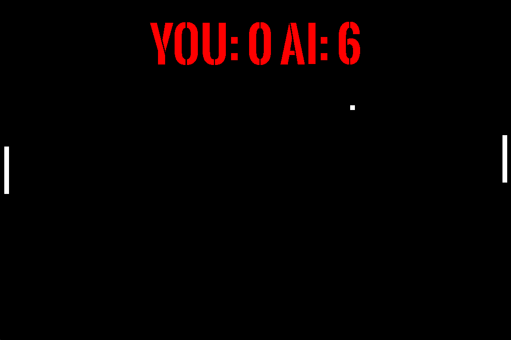

# SDL2 Pong Game

A classic Pong game implementation using the Simple DirectMedia Layer (SDL) for graphics, text rendering, and sound effect management. This is the result of my first attempt at using the SDL2 library.

## Features

- Simple Pong gameplay with simple AI opponent
- Score tracking for both player and AI
- Sound effects for ball bounces and scoring
- Adjustable game settings through constants

## Requirements

To run this project, you'll need the following installed on your system:

- SDL2
- SDL2_ttf
- SDL2_mixer

## Compilation

To compile the game, you can use the following command line `make` (assuming you have `g++` and the required libraries installed).

## Running
After compiling, you can run the game using `./pong`.

## Controls
- UP Arrow: Move paddle up
- DOWN Arrow: Move paddle down
  
The game will automatically handle the AI paddle movement, ball movement, collisions, and scoring.